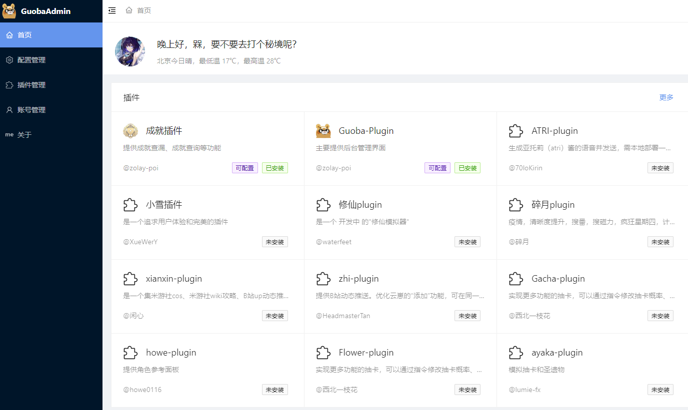
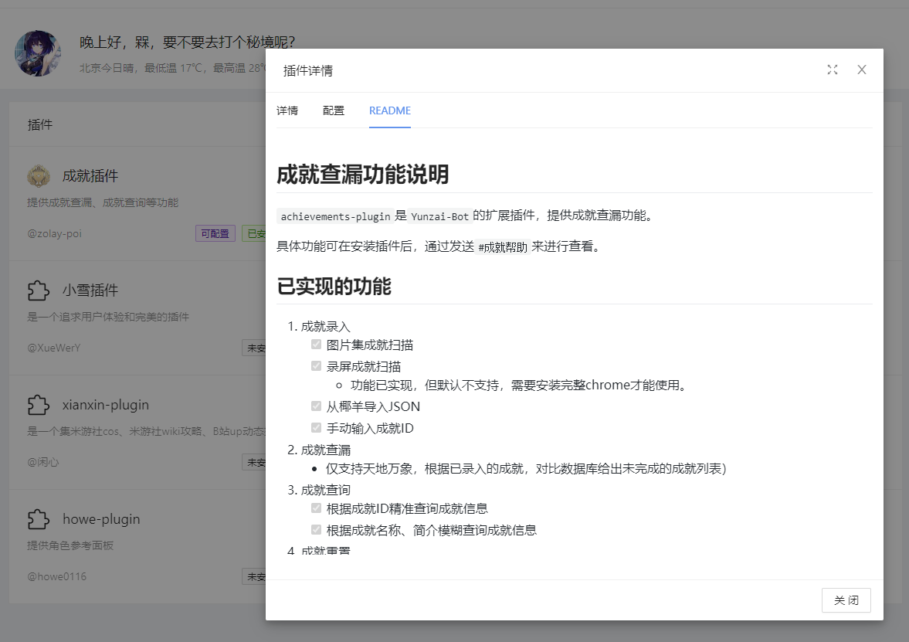
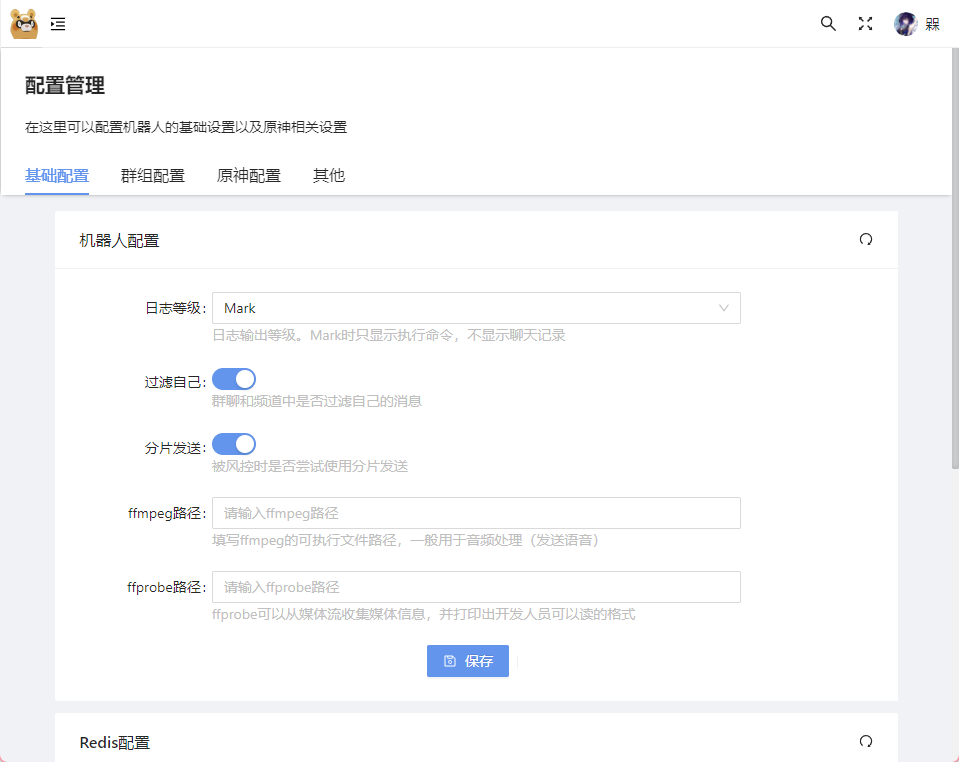
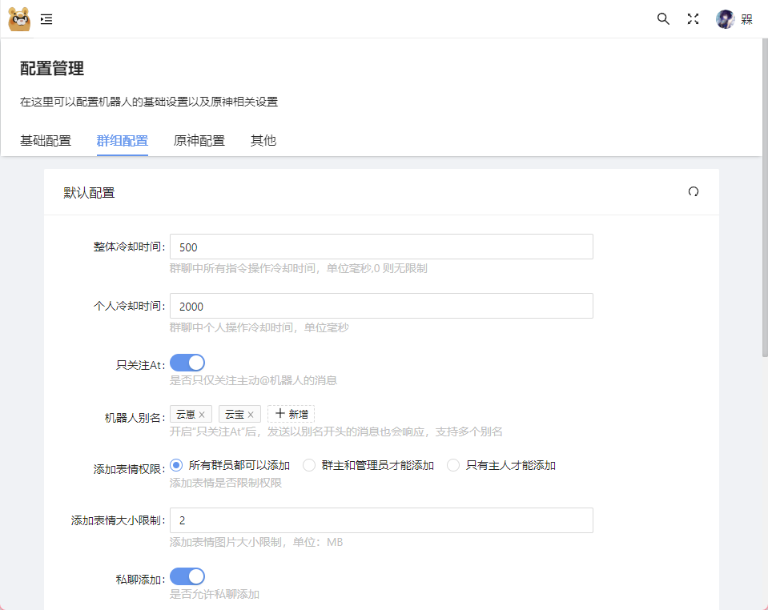
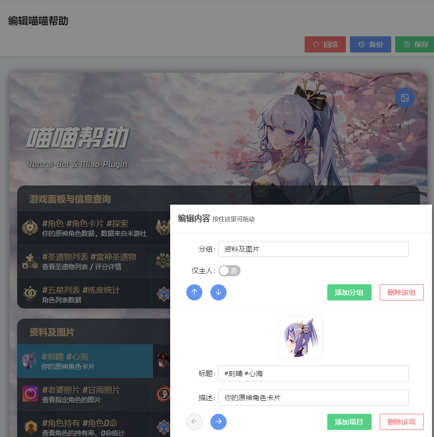

# Guoba-Plugin

`Guoba-Plugin`是`Yunzai-Bot`的扩展插件，主要提供后台管理界面。

> 管理面板仅支持V3版本的Yunzai；V2版本Yunzai仅支持迁移至V3功能。

具体功能可在安装插件后，通过发送`#锅巴帮助`来进行查看。

## 已实现的功能

- [x] 主人登录
- [x] 更新插件
- [x] 自动升级
- [x] 配置文件管理
- [x] plugin插件管理
    - [x] plugin插件配置
- [x] 编辑喵喵帮助 [@realhuhu](https://github.com/realhuhu)
- [x] V2云崽丝滑迁移至V3（[视频教程](https://www.bilibili.com/video/BV1fP411T7KM)）

[TODO代办](https://gitee.com/guoba-yunzai/resources/blob/master/other/TODO.md)

## 安装插件

#### 第 1 步：下载插件

在云崽根目录下打开终端，运行

```
git clone --depth=1 https://gitee.com/guoba-yunzai/guoba-plugin.git ./plugins/Guoba-Plugin/
```

#### 第 2 步：安装依赖

##### 方式1：采用 pnpm

> 注：如果你不是通过`pnpm`安装的云崽，那么请【**不要**】使用此方式，请看`方式2`

如果你是使用`pnpm`安装的云崽，那么只需要在云崽根目录下运行此命令即可：

```bash
pnpm install --filter=guoba-plugin
```

> 注：请务必直接复制提供的命令，否则可能会导致依赖丢失的情况，若发生需自行重新安装。<br>
> `--filter=guoba-plugin`：只安装`guoba-plugin`下的依赖，其他依赖不处理，防止丢失。

##### 方式2：采用 npm 或 cnpm

如果是使用`npm`或`cnpm`等其他依赖安装工具，需要手动安装以下依赖：

```bash
npm install express multer body-parser jsonwebtoken
```

如果以上命令执行失败，可尝试使用`cnpm`进行安装，只需将开头的`npm`替换成`cnpm`即可。

> 注：cnpm需要单独安装，已安装的可以忽略，安装命令如下：<br>
> `npm install cnpm -g --registry=https://registry.npmmirror.com`

#### 第 3 步：运行插件

依赖安装完毕之后，直接运行即可，默认运行端口号是：50831

> 可在 config/application.yaml 中修改

启动完成之后，可以在控制台中看到网页地址，复制到浏览器中即可访问。

如果访问不到，请发送`#锅巴帮助`指令获取帮助。

## 更新插件

一般会自动更新，如需手动更新，请发送`#锅巴更新`指令

# 功能预览

- 主界面
  

- 查看插件README
  

- 基础配置
  

- 群组配置
  

- 编辑喵喵帮助
  

# 免责声明

1. 功能仅限内部交流与小范围使用，严禁将Guoba-Plugin用于任何商业用途或盈利
2. 图片与其他素材均来自于网络，仅供交流学习使用，如有侵权请联系，会立即删除

# 其他

- 最后求个个star或者[爱发电](https://afdian.net/a/zolay-poi)
  你的支持是维护本项目的动力~

* Yunzai-Bot
    - [gitee](https://gitee.com/Le-niao/Yunzai-Bot)
    - [github](https://github.com/Le-niao/Yunzai-Bot)
* Yunzai插件索引
    - [gitee](https://gitee.com/yhArcadia/Yunzai-Bot-plugins-index)
    - [github](https://github.com/yhArcadia/Yunzai-Bot-plugins-index)
* Miao-Plugin
    - [gitee](https://github.com/yoimiya-kokomi/miao-plugin)
    - [github](https://github.com/yoimiya-kokomi/miao-plugin)
